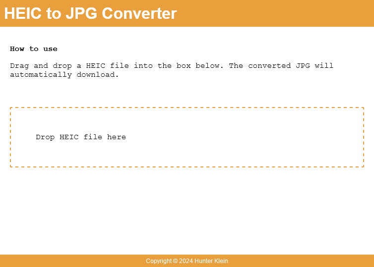

# HEIC to JPG converter

## Description

HEIC to JPG converter written in Powershell

Screenshot:



## Usage

```powershell
.\server.ps1
```

-- or --

```powershell
pode start
```

## Dependencies
- Pode (https://github.com/Badgerati/Pode)

## License
MIT